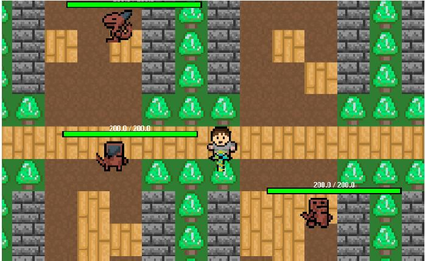
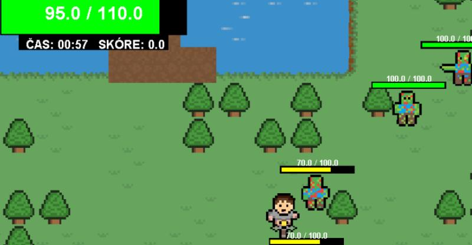
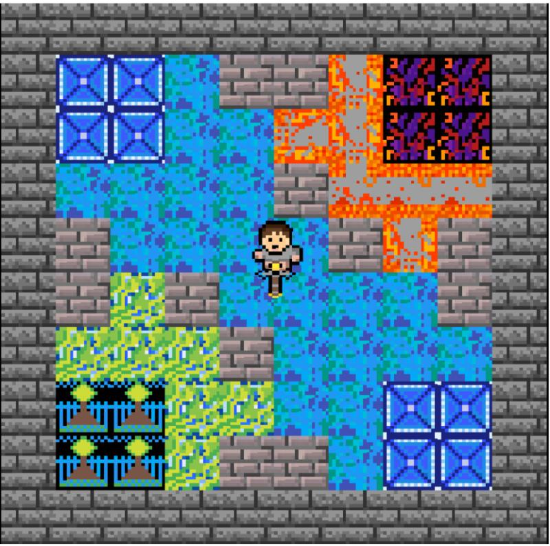

# 🏹 Monster Slayer

**Monster Slayer** is a **Java-based adventure and combat game**, developed as part of the *Informatics 2* course. The player explores different worlds, collects items, and fights various monsters using different weapons and armor. The goal is to survive, unlock doors using collected keys, and progress through the game.

---

## 🎮 Features
- **Various Weapon Types** – Multiple sword versions with different damage stats.
- **Armor System** – Different armor sets providing various levels of protection.
- **Diverse Enemies** – Face monsters such as **dragons, zombies, skeletons, and ghosts**, each with unique properties (e.g., fire resistance).
- **Item Collection** – Pick up weapons, armor, and **keys to unlock doors** and progress through levels.
- **Health & Damage System** – Every entity (player & monsters) has unique HP and attributes.
- **Explorable Worlds** – The game consists of **four different worlds**, each with unique environments and challenges.
- 
---

## 🛠 Technologies Used
- **Java (JDK 17)** – Core language for game logic.
- **Object-Oriented Programming (OOP)** – Heavy use of **polymorphism** and **inheritance**.
- **Graphics2D (java.awt.Graphics2D)** – Used for rendering game objects and environments.
- **Entity System** – Every game object (player, enemies, weapons) extends a base class using inheritance.

---

## 📸 Screenshots
Here are some screenshots of the game in action:

  

<h3 align="center">🏁 World 1 + Enemies</h3>

  

<h3 align="center">🚗 Health Bar + Zombies</h3>

  

<h3 align="center">🏆 Porting Room</h3>

---
